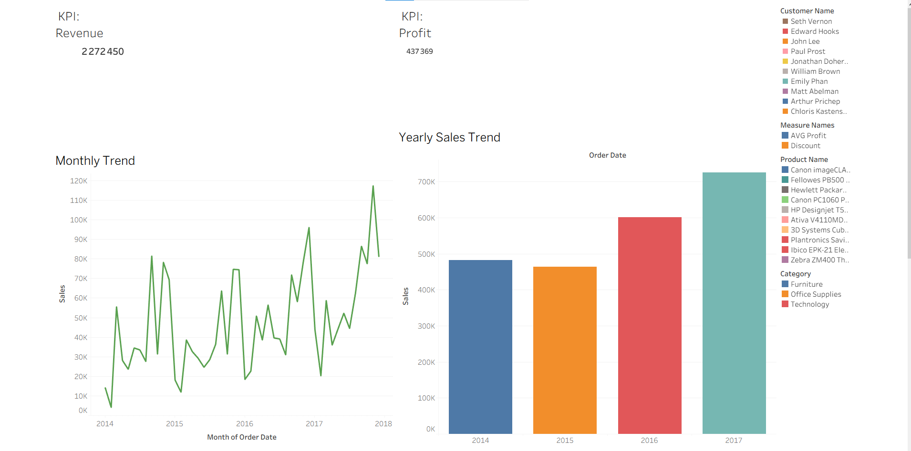
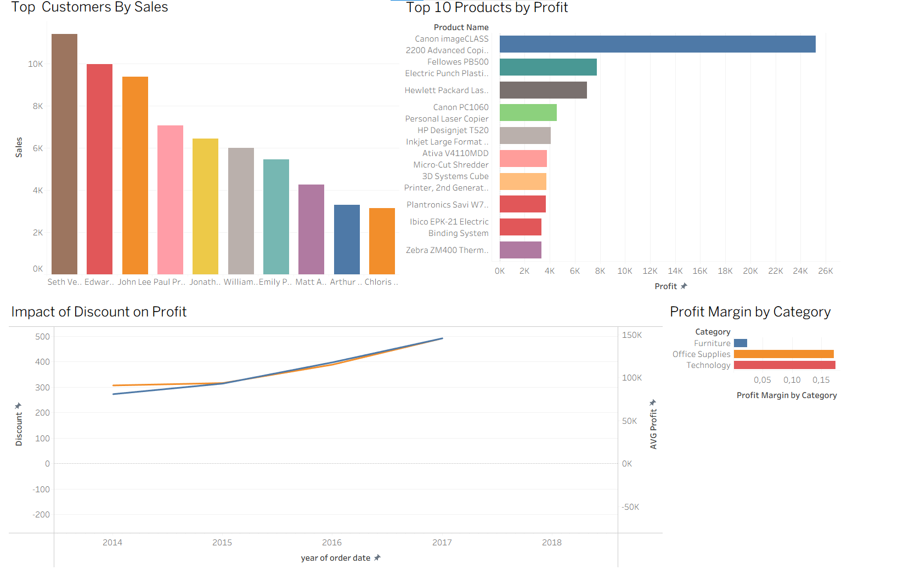

# 🛒 Superstore Sales Analysis: SQL & Tableau

## 📖 Project Overview
This project provides a comprehensive analysis of a Global Superstore's performance. By combining **SQL** for deep-dive data exploration and **Tableau** for interactive business intelligence, I uncovered key insights into profitability, customer behavior, and logistics efficiency.

## 📊 Tableau Dashboards
The analysis is visualized through two main dashboard views. You can download the interactive packaged workbook here: **[superstore project.twbx](./superstore%20project.twbx)**.

### Part 1: Executive Sales & Profit Overview
This section focuses on high-level KPIs, including total revenue, total profit, and regional performance.

### Part 2: Product & Logistics Deep-Dive
This section analyzes shipping efficiency, category performance, and the impact of discounts on the bottom line.

---

## 💻 SQL Analysis Highlights
I used MySQL to perform Exploratory Data Analysis (EDA) and calculate critical business metrics. The full script is available in **[superstore anaylyse project.sql](./superstore%20anaylyse%20project.sql)**.

### Key Queries & Logic:
* **Financial Metrics**: Calculated total revenue and total profit across the entire dataset.
* **Product Performance**: Identified the top 10 most profitable products and analyzed those resulting in net losses.
* **Time-Series Trends**: Converted string dates using `STR_TO_DATE` to analyze sales growth by month and year.
* **Logistics Efficiency**: Used `DATEDIFF` to calculate the average delivery time per shipping mode.
* **Strategic Insights**: Evaluated the correlation between discount levels and average profit margins per category.

---

## 🛠️ Technical Tools
* **SQL (MySQL)**: Used for data cleaning, date transformation, and KPI aggregation.
* **Tableau Desktop**: Used for data visualization and dashboard design using a `.twbx` packaged workbook.
* **GitHub**: Used for version control and project documentation.

## 📂 Repository Structure
* `superstore anaylyse project.sql`: The complete SQL script for data exploration.
* `superstore project.twbx`: The Tableau Packaged Workbook containing all dashboards and data.
* `/dashboard`: Folder containing `part1.png` and `part2.png` screenshots for preview.
